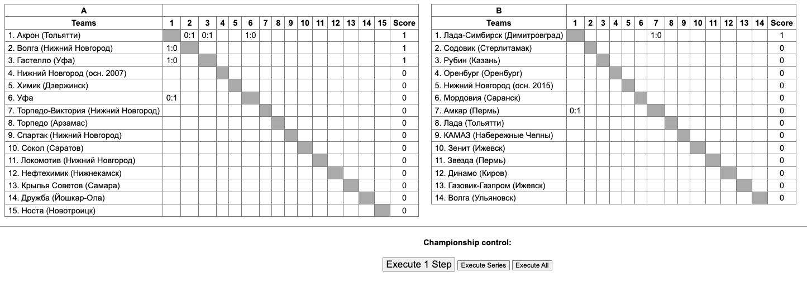
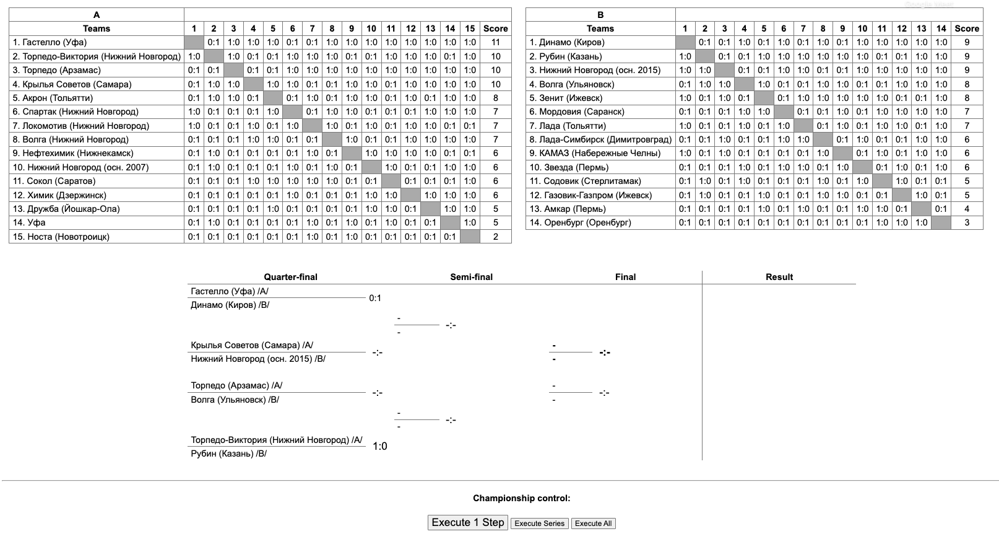
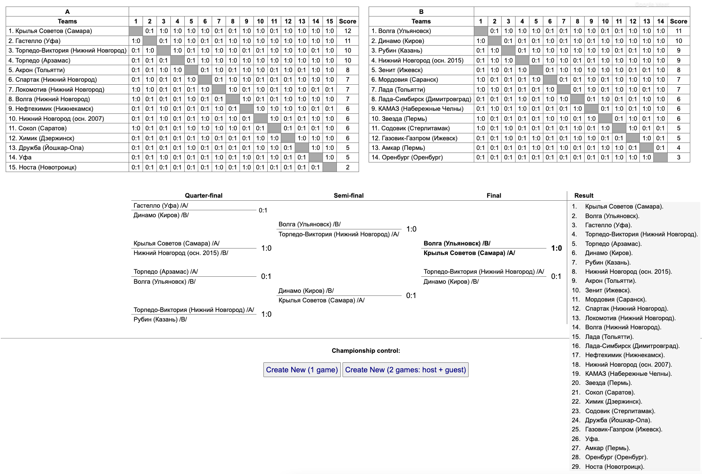

###Status: Completed

Copy `.env.dev` to `.env` before start.

The working copy should be available after starting docker-compose here: http://localhost:8000/

###Example screenshots::

A few steps after creating new Championship:

A few steps after starting Play-Off:

Finalised Championship (ready to start new one):
